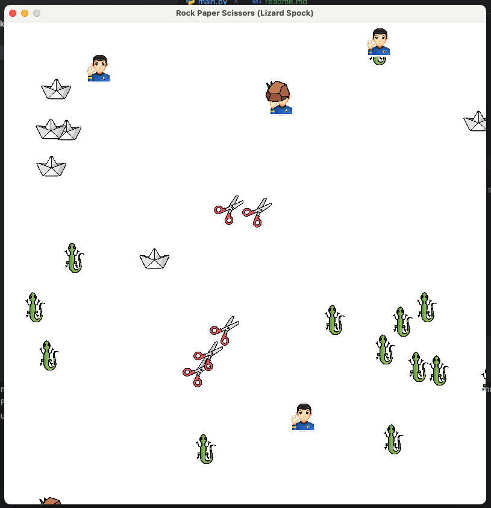
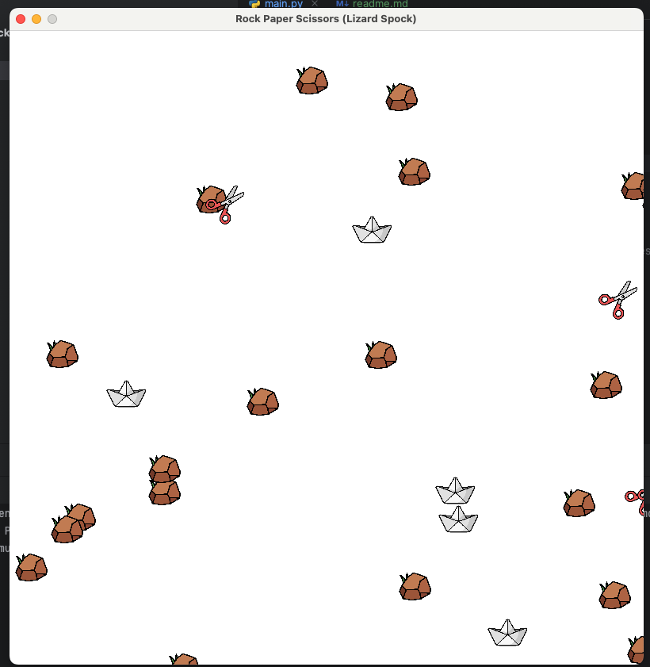

# Rock Paper Scissors Lizard Spock Simulation

## Description

Cette simulation est une représentation en 2D du jeu "Pierre, Papier, Ciseaux, Lézard, Spock" (inspiré par la série "The Big Bang Theory") et du jeu classique "Pierre, Papier, Ciseaux". La simulation se déroule dans un espace clos de 800x800 pixels où 100 entités se déplacent aléatoirement, détectent et interagissent les unes avec les autres selon les règles du jeu.

## Règles du jeu

### Pierre, Papier, Ciseaux, Lézard, Spock

- **Pierre** écrase les **Ciseaux**
- **Ciseaux** coupe le **Papier**
- **Papier** couvre la **Pierre**
- **Pierre** écrase le **Lézard**
- **Lézard** empoisonne **Spock**
- **Spock** casse les **Ciseaux**
- **Ciseaux** décapite le **Lézard**
- **Lézard** mange le **Papier**
- **Papier** réfute **Spock**
- **Spock** vaporise la **Pierre**

### Pierre, Papier, Ciseaux (Mode Simple)

- **Pierre** écrase les **Ciseaux**
- **Ciseaux** coupe le **Papier**
- **Papier** couvre la **Pierre**

## Fonctionnalités

- **Déplacement aléatoire** : Les entités se déplacent de manière aléatoire dans l'espace de simulation.
- **Détection des collisions** : Chaque entité a un rayon de détection et change de direction lorsqu'elle détecte une autre entité.
- **Interaction** : Lorsqu'une entité détecte une autre entité, elle change de type en fonction des règles du jeu si elle est plus faible.
- **Affichage graphique** : Chaque entité est représentée par une image de smiley, avec des cercles pour indiquer la zone de détection et la position de collision.
- **Mode de jeu** : Possibilité de passer du jeu complet à cinq options au jeu simple à trois options via une variable booléenne.

## Prérequis

- Python 3.x
- Pygame (`pip install pygame`)

## Installation

1. Clonez le dépôt ou téléchargez les fichiers sources.
2. Assurez-vous que les fichiers d'icônes (`rock.png`, `paper.png`, `scissors.png`, `lizard.png`, `spock.jpg`) sont dans un dossier nommé `icons`.

## Utilisation

1. Assurez-vous que Pygame est installé : `pip install pygame`
2. Pour exécuter la simulation, utilisez la commande suivante dans le terminal :
    ```sh
    python simulation.py
    ```

## Configuration

Pour basculer entre les modes de jeu, modifiez la valeur de `SIMPLE_GAME` dans le fichier `simulation.py` :

- Mode complet : `SIMPLE_GAME = False`
- Mode simple : `SIMPLE_GAME = True`

## Captures d'écran

### Mode complet



### Mode simple



## Auteur
Simon STEPHAN \
Idée originale de Sheldon Cooper (The Big Bang Theory)